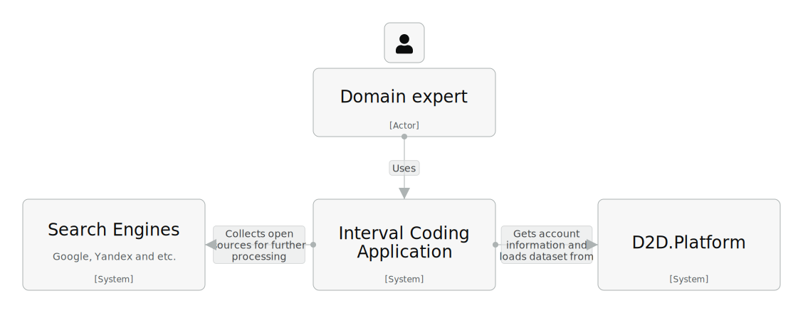
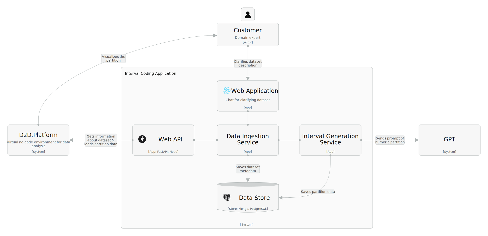
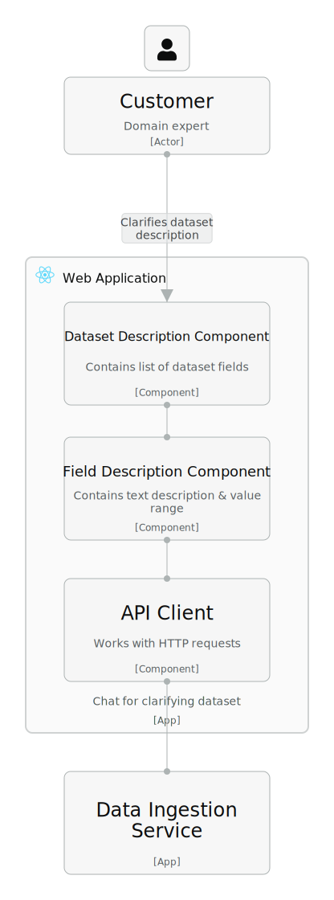
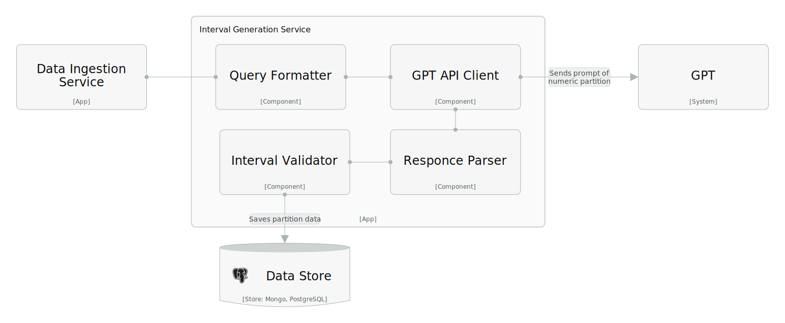

# Использование нотации C4 model
## Диаграмма системного контекста
Приложение "Interval Coding Application" будет взаимодействовать с одним типом пользователей, а также с 2 внешними системами: поисковиками для нахождении источников и D2D.Platform при загрузке набора данных. Диаграмма контекста разрабатываемого приложения представлена ниже.

Полную версию диаграммы можно посмотреть [здесь](https://s.icepanel.io/BOv5YUhxdc33g6/ZRLw).
## Диаграмма контейнеров
Для проектирования приложения выбрана архитектура на основе сервисов. Данный тип архитектуры позволит поддержать приемлемый уровень надёжности и масштабируемости приложения при небольших затратах.
Выделены следующие контейнеры:
* *Web Application* — интерфейс пользователя;
* *Web API* — сервис для взаимодействия с D2D.Platform;
* *Data Ingestion Service* — сервис для анализа метаданных набора данных;
* *Interval Generation Service* — сервис для взаимодействия с GPT;
* *Data Store* — хранилище данных.

Диаграмма контейнеров разрабатываемого приложения представлена ниже.

Полную версию диаграммы можно посмотреть [здесь](https://s.icepanel.io/BOv5YUhxdc33g6/XAfI).
## Диаграммы компонентов
[ComponentDiagram](example.com)
Для контейнеров [Web Application](https://s.icepanel.io/BOv5YUhxdc33g6/Xcv0) и [Interval Generation Service](https://s.icepanel.io/BOv5YUhxdc33g6/jtox) были спроектированы компоненты, показанные на рисунках ниже.

